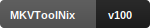
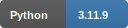
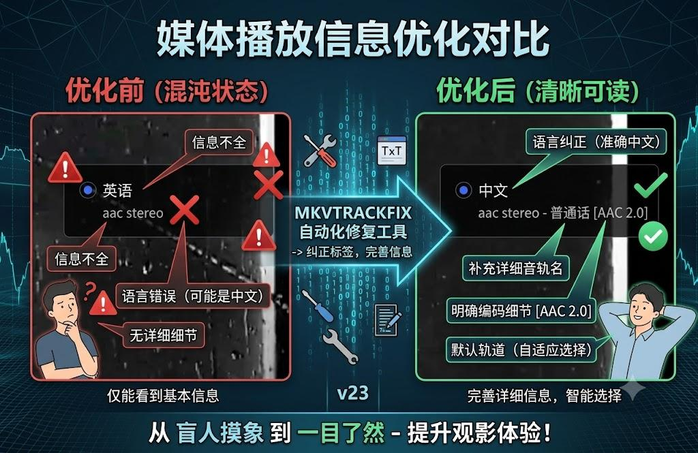
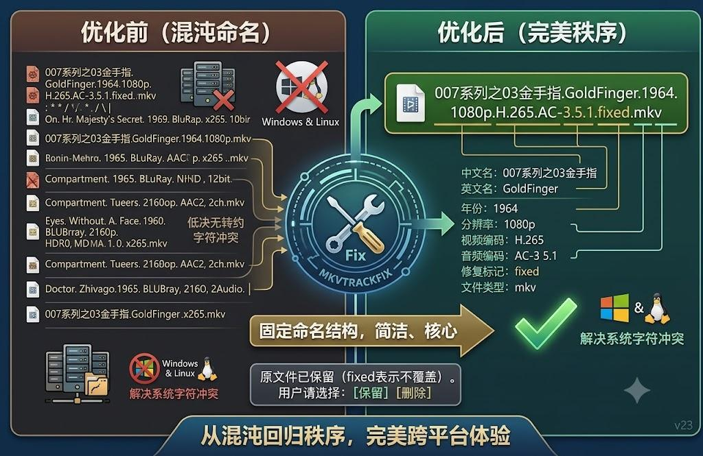

<div align="center">

# 🎬 mkvtrackfix

### 电影音轨 / 字幕标签批量修复工具

**v23 · Active Development · Powered by Faster-Whisper + RapidOCR-OpenVINO + MKVToolNix**

<br>

<!-- 主品牌徽章 -->
<a href="../../releases"></a>
<a href="LICENSE"></a>


<br>

<!-- AI / ML 引擎（开源关联，可点击） -->
<a href="https://github.com/SYSTRAN/faster-whisper"></a>
<a href="https://github.com/RapidAI/RapidOCR"></a>
<a href="https://www.modelscope.cn/models/gpustack/faster-whisper-medium"></a>
<a href="https://huggingface.co/Systran/faster-whisper-medium"></a>

<br>

<!-- 原生工具链（可点击主页） -->
<a href="https://ffmpeg.org/"></a>
<a href="https://mkvtoolnix.download/"></a>
<a href="https://www.riverbankcomputing.com/software/pyqt/"></a>
<a href="https://www.themoviedb.org/"></a>
<a href="https://github.com/giampaolo/psutil"></a>

<br>

<!-- 运行环境 -->
<a href="https://www.python.org/"></a>


<a href="https://pypi.org/"></a>

<br>

[📥 下载便携版](../../releases) · [📝 更新日志](CHANGES.md) · [🐛 反馈问题](../../issues) · [📖 补充手册](READMEPLUS.md) · [⭐ Star](../../stargazers)

</div>

---
# 电影音轨 / 字幕标签批量修复工具（v23.16） mkvtrackfix
- 批量修复 mp4 / mkv 电影的音轨与字幕语言标签，并把 mp4 重新封装为 mkv。
- 支持 UNC 网络路径（NAS），带 GUI、AI 识别、非破坏式输出与干跑预览。

---

## 项目说明

我们在使用 NAS 囤积电影的核心问题是什么？资源来自五湖四海，必然混乱。


除了音轨、字幕轨道超级多以外，标签的规范化是乱的，尤其是大量 `und` 标签。所以 mkvtrackfix 的核心就是**借助 AI 模型真正识别音轨语言、字幕语言，然后重新修订**；当然太多的音轨、字幕轨道我们也能顺带剔除——很多 30GB 的视频剔除不必要的字幕和音轨后，体积可减小到 24GB。实际我们只需要保留主要的字幕（如简中英双语），以及质量更好的普通话 / 英语音轨即可。



同时健全标签命名和名称，在不同的播放器都一目了然。



这些都解决了，最后我们**优化视频文件的命名**：简洁、直观，解决字符串冲突。因为很多朋友是从 Windows 把数据扔到 NAS（Linux），很可能 NAS 没处理好就看不到文件了——所以咱们这个工具就干这事。

> 源码约 200KB（实际含注释约 290KB），支持库约 1.7GB 压缩包（可选 Patch 合并离线直接使用）。

---

## 主要功能

- **音轨语言 AI 识别**：用 `faster-whisper` 听取每条音轨片段（默认 10 秒×3段），识别语言。
- **规范标签**：写入 IETF BCP 47 语言码（如 `cmn`/`cmn-Hans`/`eng`），轨道名按编码与声道命名。
- **音轨精简策略**：保留 英语 + 普通话；无普通话时保留 英语 / 粤语。
- **字幕修复**：文本字幕直接读取；`sup`/`PGS` 等图像字幕使用 **ffmpeg 抽帧 + RapidOCR（OpenVINO）**，
  自动区分 **简体 / 繁体 / 中英双语**，支持简繁正确识别。
- **统一转封装**：非破坏式输出（`<名>.fixed.mkv`），直接写 NAS 目标目录。

---

## 快速开始（绿色便携版）

1. 双击 **`build_portable.bat`**：自动下载便携 Python、安装依赖（含 RapidOCR）、下载 ffmpeg / mkvmerge。
2. 之后每次双击 **`run.bat`** 即可运行。

---

## 主要变更

### ✏️ v23.16 — 记录编辑器：删除行 + 断点续传
- **表格右键「删除选中行」**：扫描后发现个别文件不行、或想剔除某条，右键直接删，自动同步清理内部状态。处理进行中自动禁用删除（提示先停止），避免错位。
- **断点续传**：「保存记录」现在额外记录每行的处理状态与「已完成」标记；重新「导入记录」后，已完成的行**自动标绿**，再次「开始处理」时 Worker **自动跳过**它们，只跑剩余任务。无需手动删已完成行，也不会重复处理。
- 完整闭环：扫描 → 右键删掉不行的 → 开始处理 → 中途失败「停止」→ 保存记录 → 重开导入 → 只处理剩下的。老版本（v1）记录兼容导入。

### 🐛 v23.15 — 调试模式磁盘打满修复（重要）
- **问题**：开启「调试模式」批量处理（如 73 个任务）会写满 C 盘（`[Errno 28] No space left on device`）。
- **根因**：调试模式本意是保留当前任务中间产物供排查，但旧实现写成了**所有任务产物永久保留、跨任务不清理**——音频 WAV、PGS 字幕 OCR 帧、UNC 整片副本全部堆积在 `tmp/temp/`。
- **修复（滑动窗口清理）**：成功/跳过任务立即清理；失败 + 调试仅保留最近一个失败任务的快照（`tmp/debug_last/`）；启动/收尾/关闭额外清理。磁盘占用从此**有硬上限**，不再随任务数线性增长，调试排查能力保留。

### v23 正式版
- **托盘图标动画**：墨镜（待机）→ 放大镜（扫描）→ 齿轮（处理）→ 绿色对勾（完成）+ 提示音
- **提取+检测分离**：音轨一次性批量提取三段 WAV（仅一次 NAS），再统一 AI 检测
- **PGS 字幕优化**：`color=black:r=1` 解决 `shortest=1` 漏帧 + 无限制溢出问题
- **IPC 通信**：QLocalServer → 文件轮询（零依赖，托盘动画实时同步）
- **流量统计**：`psutil` 任务结束时蓝色输出网络读取/写入量
- **详细日志**：默认勾选「详细记录第三方工具输出」
- **SVG 手绘图标**：窗口场记板 / 系统托盘墨镜 / 放大镜 / 齿轮 / 绿色对勾

### v22 正式版
- **OCR 引擎**：Tesseract → RapidOCR（基于 OpenVINO/ONNX Runtime，速度快 5 倍，简繁识别准确）
- **MKVToolNix**：升级至 v100（支持 IETF BCP 47 语言标签直写）
- **电影产地判断**：豆瓣 → TMDB（themoviedb.org，无需 API Key）
- **系统监控**：CPU / 内存 / 网络(上下行) / 磁盘(读写) 实时趋势图
- **输出流程**：直接写 NAS 目标路径，省去本地缓存搬运
- **配置文件自动升级**：版本号变更时自动重置为新默认值

---

## 使用流程

### 基础三步
1. 填写源路径（支持 UNC 网络路径），点「收集文件」
2. 点「扫描并预览」→ 查看每条轨道的识别结果和计划动作
3. 确认无误后点「开始处理」→ mkvmerge 转封装输出 `.fixed.mkv`

### ✏️ 记录编辑：删掉不行的
扫描后发现个别文件识别失败、或不想处理某几条？**在表格上右键 → 「删除选中行」**即可剔除，剩余任务照常处理——不必整批重来。

### 🔁 断点续传：处理到一半也能接着跑
大批量处理中途失败/想暂停？无需从头再来：

1. 处理中遇问题，点「停止当前」让当前任务收尾；
2. 点「保存记录」——记录里已自动标记哪些文件**处理成功（已完成）**；
3. 关掉程序或修好环境后，点「导入记录」——已完成的行会**自动标绿**；
4. 再点「开始处理」——Worker 会**自动跳过已完成**的文件，只处理剩下的。

> 即便你手动右键删掉了已完成行再保存，行为也完全一致。断点续传的正确性依赖于「已完成的物理输出已落在 NAS 上」，非破坏式输出（`.fixed.mkv` / 重命名）不会因重跑而覆盖已有成果。

---

## 目录结构

```
mediameta_fixer/
├── main.py                 # 入口
├── run.bat                 # 日常启动
├── build_portable.bat      # 组装绿色便携包
├── requirements.txt
├── core/                   # 核心逻辑
│   ├── logger.py / config.py / utils.py
│   ├── probe.py / remux.py / pipeline.py
│   ├── audio_detect.py / ai_worker.py / ai_child.py
│   ├── subtitle_detect.py / policy.py / lang_map.py
│   └── sys_monitor.py
├── gui/                    # 图形界面
│   ├── main_window.py / settings_dialog.py / widgets.py
│   └── sys_widget.py
├── tools/                  # 原生工具（ffmpeg / mkvmerge）
├── models/                 # AI 模型
└── logs/                   # 运行日志
```

---

## 📖 语言码字典

工具内置 **完整 105 条语言码映射**，覆盖 Whisper 全部 99 种语言 + 内部码，确保任意 Faster-Whisper 识别结果都能合规写入 MKV。未知语种自动降级为 `und`（未定义语言）。

### 🎯 Whisper 原生音轨码（100 条）

| ISO 639-1 | ISO 639-2 | 中文名 | English |
|:---------:|:---------:|:------|:--------|
| af | afr | 南非荷兰语 | Afrikaans |
| am | amh | 阿姆哈拉语 | Amharic |
| ar | ara | 阿拉伯语 | Arabic |
| as | asm | 阿萨姆语 | Assamese |
| az | aze | 阿塞拜疆语 | Azerbaijani |
| ba | bak | 巴什基尔语 | Bashkir |
| be | bel | 白俄罗斯语 | Belarusian |
| bg | bul | 保加利亚语 | Bulgarian |
| bn | ben | 孟加拉语 | Bengali |
| bo | bod | 藏语 | Tibetan |
| br | bre | 布列塔尼语 | Breton |
| bs | bos | 波斯尼亚语 | Bosnian |
| ca | cat | 加泰罗尼亚语 | Catalan |
| cs | ces | 捷克语 | Czech |
| cy | cym | 威尔士语 | Welsh |
| da | dan | 丹麦语 | Danish |
| de | deu | 德语 | German |
| el | ell | 希腊语 | Greek |
| en | eng | 英语 | English |
| es | spa | 西班牙语 | Spanish |
| et | est | 爱沙尼亚语 | Estonian |
| eu | eus | 巴斯克语 | Basque |
| fa | fas | 波斯语 | Persian |
| fi | fin | 芬兰语 | Finnish |
| fo | fao | 法罗语 | Faroese |
| fr | fra | 法语 | French |
| gl | glg | 加利西亚语 | Galician |
| gu | guj | 古吉拉特语 | Gujarati |
| ha | hau | 豪萨语 | Hausa |
| haw | haw | 夏威夷语 | Hawaiian |
| he | heb | 希伯来语 | Hebrew |
| hi | hin | 印地语 | Hindi |
| hr | hrv | 克罗地亚语 | Croatian |
| ht | hat | 海地克里奥尔语 | Haitian Creole |
| hu | hun | 匈牙利语 | Hungarian |
| hy | hye | 亚美尼亚语 | Armenian |
| id | ind | 印尼语 | Indonesian |
| is | isl | 冰岛语 | Icelandic |
| it | ita | 意大利语 | Italian |
| ja | jpn | 日语 | Japanese |
| jw | jav | 爪哇语 | Javanese |
| ka | kat | 格鲁吉亚语 | Georgian |
| kk | kaz | 哈萨克语 | Kazakh |
| km | khm | 高棉语 | Khmer |
| kn | kan | 卡纳达语 | Kannada |
| ko | kor | 韩语 | Korean |
| la | lat | 拉丁语 | Latin |
| lb | ltz | 卢森堡语 | Luxembourgish |
| ln | lin | 林加拉语 | Lingala |
| lo | lao | 老挝语 | Lao |
| lt | lit | 立陶宛语 | Lithuanian |
| lv | lav | 拉脱维亚语 | Latvian |
| mg | mlg | 马达加斯加语 | Malagasy |
| mi | mri | 毛利语 | Maori |
| mk | mkd | 马其顿语 | Macedonian |
| ml | mal | 马拉雅拉姆语 | Malayalam |
| mn | mon | 蒙古语 | Mongolian |
| mr | mar | 马拉地语 | Marathi |
| ms | msa | 马来语 | Malay |
| mt | mlt | 马耳他语 | Maltese |
| my | mya | 缅甸语 | Myanmar (Burmese) |
| ne | nep | 尼泊尔语 | Nepali |
| nl | nld | 荷兰语 | Dutch |
| nn | nno | 挪威尼诺斯克语 | Norwegian Nynorsk |
| no | nor | 挪威语 | Norwegian |
| oc | oci | 奥克语 | Occitan |
| pa | pan | 旁遮普语 | Punjabi |
| pl | pol | 波兰语 | Polish |
| ps | pus | 普什图语 | Pashto |
| pt | por | 葡萄牙语 | Portuguese |
| ro | ron | 罗马尼亚语 | Romanian |
| ru | rus | 俄语 | Russian |
| sa | san | 梵语 | Sanskrit |
| sd | snd | 信德语 | Sindhi |
| si | sin | 僧伽罗语 | Sinhala |
| sk | slk | 斯洛伐克语 | Slovak |
| sl | slv | 斯洛文尼亚语 | Slovenian |
| sn | sna | 绍纳语 | Shona |
| so | som | 索马里语 | Somali |
| sq | sqi | 阿尔巴尼亚语 | Albanian |
| sr | srp | 塞尔维亚语 | Serbian |
| su | sun | 巽他语 | Sundanese |
| sv | swe | 瑞典语 | Swedish |
| sw | swa | 斯瓦希里语 | Swahili |
| ta | tam | 泰米尔语 | Tamil |
| te | tel | 泰卢固语 | Telugu |
| tg | tgk | 塔吉克语 | Tajik |
| th | tha | 泰语 | Thai |
| tk | tuk | 土库曼语 | Turkmen |
| tl | tgl | 他加禄语 | Tagalog |
| tr | tur | 土耳其语 | Turkish |
| tt | tat | 鞑靼语 | Tatar |
| uk | ukr | 乌克兰语 | Ukrainian |
| ur | urd | 乌尔都语 | Urdu |
| uz | uzb | 乌兹别克语 | Uzbek |
| vi | vie | 越南语 | Vietnamese |
| yi | yid | 意第绪语 | Yiddish |
| yo | yor | 约鲁巴语 | Yoruba |
| yue | yue | 粤语 | Cantonese |
| zh | cmn | 普通话 | Mandarin Chinese |

### 🏷️ 内部码（字幕/策略用，5 条）

| 码 | ISO 输出 | 说明 |
|:--:|:--------:|:----|
| cmn | cmn | 普通话（直接码） |
| chi | cmn | Matroska 传统中文码 |
| zho | cmn | ISO 639-2 变体 |
| cmn-hans | cmn-hans | 简体中文字幕（BCP 47） |
| cmn-hant | cmn-hant | 繁体中文字幕（BCP 47） |

> **🔒 兜底保护**：不在表中的任何语言码 → 自动降级为 `und`（未定义语言），保证 `mkvmerge` 绝不因语言码参数报错。
